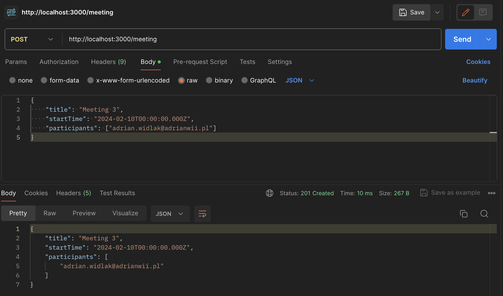
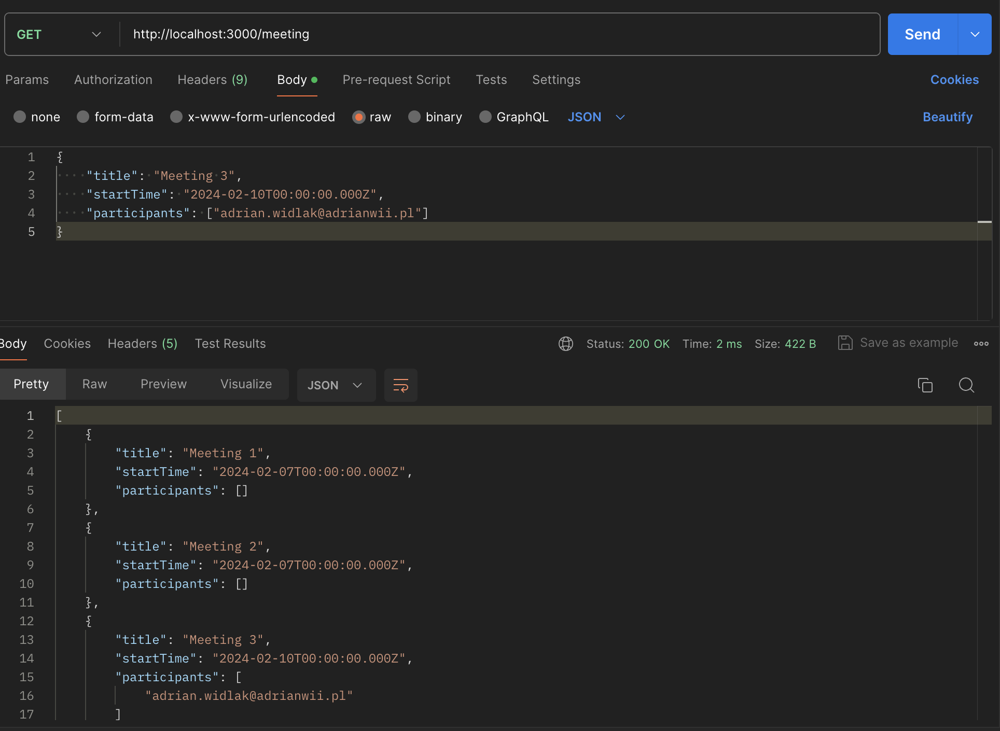
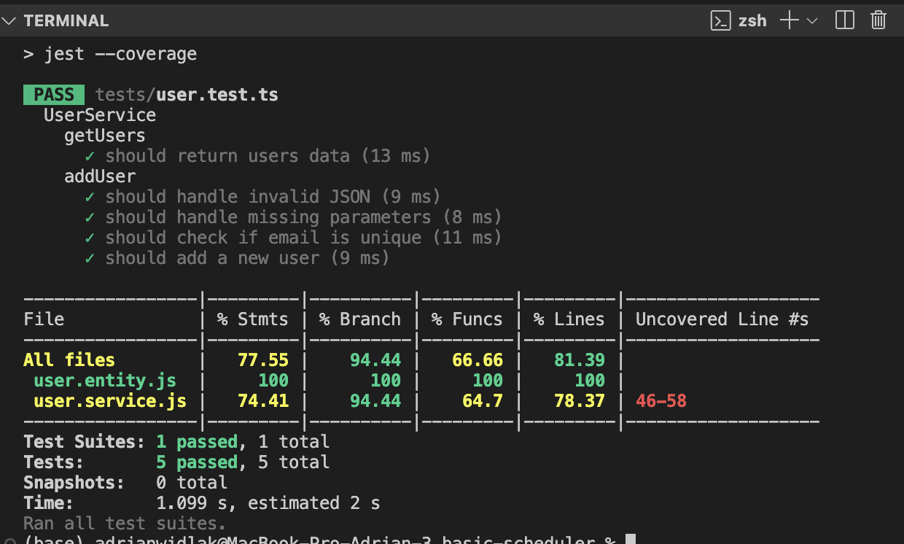
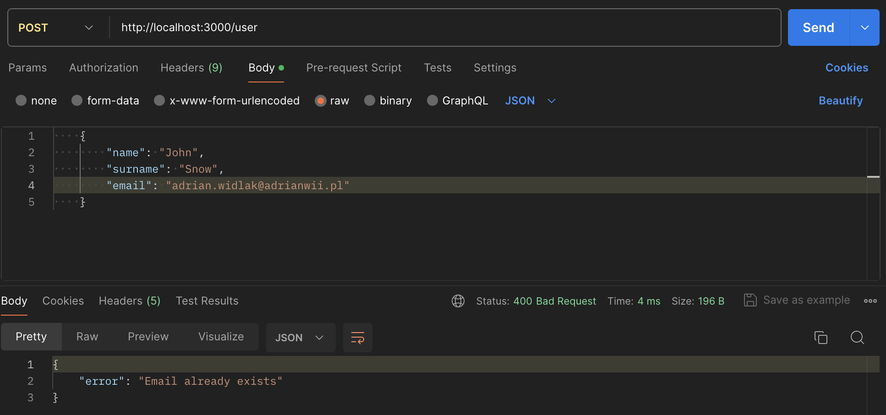

## Description

Sample api for scheduling meetings based on own basic backend core.

## Used technologies

 
 

## Demo

# POST: /user
Adding new user.

exanple body:
```
    {
        "name": "John",
        "surname": "Snow",
        "email": "john.snow@adrianwii.pl"
    }
```
<div style="text-align:center;">
    
</div>


# GET: /user
List of all users.
<div style="text-align:center;">
    
</div>

# POST: /meeting
Adding new meeting.

exanple body:
```
{
    "title": "Meeting 3",
    "startTime": "2024-02-10T00:00:00.000Z",
    "participants": ["adrian.widlak@adrianwii.pl"]
}
```
<div style="text-align:center;">
    
</div>

# GET: /meeting
List of all meetings.
<div style="text-align:center;">
    
</div>


# Running the app

```bash
$ npx tsc

$ node main.js

```

## Test

```bash
# unit tests
$ npm run test

```

Example output from cosole after running tests:

<div style="text-align:center;">
    
</div>


Example output from postman after running manual tests:

<div style="text-align:center;">
    
</div>

## Author

- [@AdrianWii](https://www.github.com/AdrianWii)
